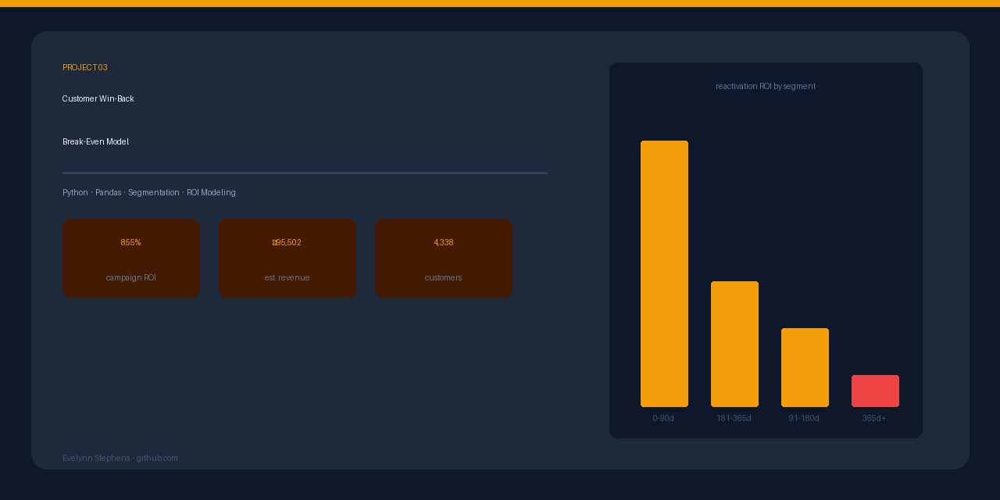

# Customer Win-Back Analysis: When Does Re-engagement Cost More Than Acquisition?
 
## Business Problem
 
Every organization with a customer base faces the same question: when a customer goes quiet, is it worth spending money to win them back — or is it cheaper to find someone new?
 
This project builds a break-even model to answer that question with data, identifying which lapsed customer segments deliver positive ROI on reactivation investment and which should be written off in favor of new acquisition.
 
> *"This analysis was inspired by a question I answer regularly in nonprofit fundraising — but the methodology applies equally to any subscription, retail, or membership business trying to decide whether to invest in win-back campaigns or focus budget on new customer acquisition."*
 
---
 
## Dataset
 
- **Source:** E-Commerce Customer Transaction Dataset via Kaggle
- **Size:** 541,909 transactions cleaned to 397,884 after data quality processing
- **Customers:** 4,338 unique customers across 38 countries
- **Period:** December 2010 — December 2011
- **Total Revenue:** £8,911,407
 
---
 
## Data Cleaning & Feature Engineering
 
### Issues identified and resolved:
 
| Issue | Count | Action |
|---|---|---|
| Missing CustomerIDs (guest checkouts) | 135,080 | Removed — behavior untraceable |
| Negative quantities (returns) | 10,624 | Removed |
| Zero or negative prices | 2,517 | Removed |
| Missing product descriptions | 1,454 | Retained — not needed for analysis |
 
### Features engineered:
 
- **Revenue** — Quantity x Unit Price per transaction
- **Days since last purchase** — calculated from reference date
- **Customer lifespan** — first to last purchase in days
- **Lapse segment** — bucketed by recency
- **Reactivation cost** — estimated by segment based on industry benchmarks
- **Expected revenue** — avg order value x segment response rate
- **Net return** — expected revenue minus reactivation cost
- **Reactivation ROI** — net return as a percentage of reactivation cost
 
---
 
## Lapse Segmentation
 
| Segment | Customers | Avg Order Value | Avg Total Revenue |
|---|---|---|---|
| 0-90 days (active) | 2,889 | £50.77 | £2,726 |
| 91-180 days (warm) | 589 | £37.41 | £814 |
| 181-365 days (lapsed) | 791 | £157.23 | £672 |
| 365+ days (deep lapsed) | 69 | £49.55 | £353 |
 
**Key finding:** Customers lapsed 181-365 days show the highest average order value at £157 — nearly 3x active customers. Mid-lapsed customers have not necessarily disengaged permanently; they have simply been overlooked.
 
---
 
## Break-Even Analysis
 
Response rates applied by segment based on industry win-back benchmarks:
 
| Segment | Response Rate | Reactivation Cost | Expected Revenue | Net Return | ROI |
|---|---|---|---|---|---|
| 0-90 days (active) | 45% | £2 | £22.85 | £20.85 | 1,042% |
| 91-180 days (warm) | 25% | £5 | £9.35 | £4.35 | 87% |
| 181-365 days (lapsed) | 15% | £8 | £23.58 | £15.58 | 195% |
| 365+ days (deep lapsed) | 5% | £12 | £2.48 | -£9.52 | -79% |
 
**Critical finding:** Reactivation delivers positive ROI for customers lapsed up to 12 months. Beyond 365 days, the cost of reactivation exceeds expected return — making new customer acquisition the smarter investment.
 
---
 
## Budget Recommendation
 
Applied to a £10,000 win-back budget:
 
| Segment | Recommended Budget | Customers Reached | Expected Revenue |
|---|---|---|---|
| 0-90 days (active) | £7,872 | 3,936 | £89,938 |
| 181-365 days (lapsed) | £1,471 | 184 | £4,339 |
| 91-180 days (warm) | £657 | 131 | £1,225 |
| 365+ days (deep lapsed) | £0 | 0 | £0 |
| **Total** | **£10,000** | **4,251** | **£95,502** |
 
**Overall campaign ROI: 855%**
 
A £10,000 win-back campaign targeting customers lapsed under 12 months generates an estimated £95,502 in revenue. Deep lapsed customers beyond 365 days receive zero budget as reactivation cost exceeds expected return.
 
---
 
## Strategic Recommendations
 
1. **Intervene early** — the window for cost-effective reactivation closes at 12 months. Organizations waiting until customers are 2+ years lapsed are investing in a negative ROI activity
2. **Prioritize active and warm segments** — 0-90 day customers deliver 1,042% ROI on reactivation spend and should receive the majority of win-back budget
3. **Mid-lapsed customers are undervalued** — the 181-365 day segment shows the highest average order value, suggesting these customers have strong purchase intent but have simply fallen through the cracks
4. **Write off deep lapsed** — beyond 365 days, redirect budget to new customer acquisition where ROI is more predictable
 
---
 
## Tools Used
 
- Python (Pandas, NumPy, Matplotlib, Seaborn)
- Jupyter Notebook
- Kaggle
 
---
 
## Why This Matters
 
In my work as a Fundraising Analyst, one of the most common strategic debates is how long to keep pursuing lapsed donors before writing them off. Organizations routinely spend budget on 3-5 year lapsed donors out of habit rather than evidence. This project builds the analytical case for earlier intervention — a finding that applies equally to nonprofit fundraising, retail win-back campaigns, and subscription businesses managing churn.
 
The methodology is transferable. The business problem is universal.

*Project by Evelynn Stephens | [LinkedIn](https://www.linkedin.com/in/evelynn-stephens-datascience/) | stephensevelynn@gmail.com*
